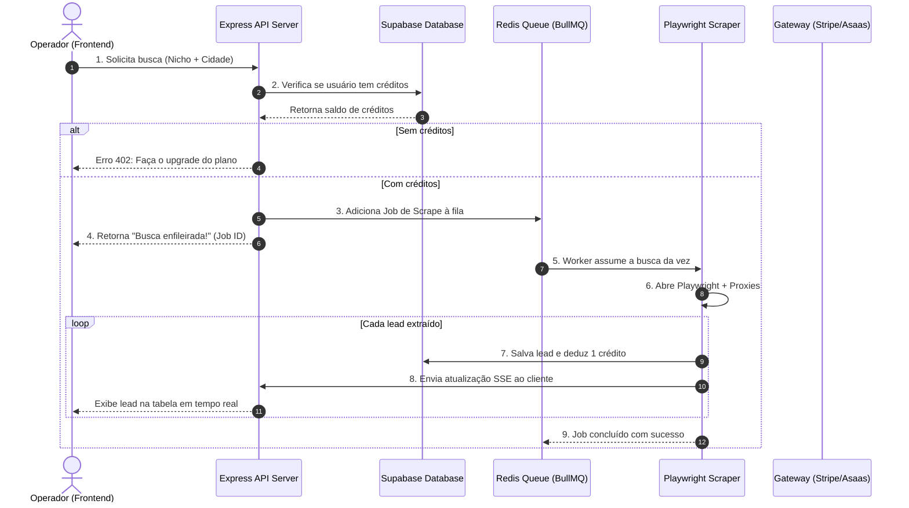
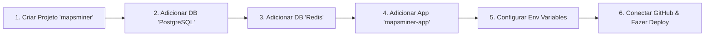

# 🗺️ Plano Mestre de Implantação: MapsMiner Micro SaaS

Este é o seu **plano de execução completo, prático e cronológico** para transformar o extrator local **MapsMiner** em um **Micro SaaS comercializável na nuvem**, aproveitando a sua **VPS DigitalOcean com Easypanel** para manter o custo de infraestrutura perto de zero.

Dividimos o projeto em **5 Fases Chronológicas**. Cada uma contém os passos exatos de código, arquitetura e configuração que você precisa implementar.

---

## 📊 Arquitetura de Fluxo do SaaS



---

## 📅 FASE 1: Refatoração da Arquitetura Local (Código & Banco de Dados)
*Prazo estimado: 5 a 7 dias*

O objetivo desta fase é migrar a sua aplicação Express de "monolito síncrono" para uma **arquitetura distribuída com fila de tarefas assíncrona** usando **BullMQ (Redis)** e banco de dados **Supabase**.

### Passo 1.1: Instalar as Dependências no Projeto
Abra o terminal da sua aplicação local e rode:
```bash
npm install @supabase/supabase-js bullmq ioredis dotenv bcryptjs jsonwebtoken
```

### Passo 1.2: Modelar o Banco de Dados (Supabase/PostgreSQL)
Crie as seguintes tabelas no painel do Supabase utilizando o SQL Editor. Esta estrutura garante o controle de usuários, créditos e histórico de leads:

```sql
-- 1. Tabela de Perfis de Usuários (com controle de créditos)
CREATE TABLE profiles (
  id UUID PRIMARY KEY REFERENCES auth.users ON DELETE CASCADE,
  email TEXT UNIQUE NOT NULL,
  credits INTEGER DEFAULT 50 NOT NULL, -- Franquia inicial grátis
  plan TEXT DEFAULT 'free' NOT NULL,   -- 'free', 'starter', 'pro', 'growth'
  created_at TIMESTAMP WITH TIME ZONE DEFAULT TIMEZONE('utc'::text, NOW()) NOT NULL
);

-- 2. Tabela de Histórico de Buscas
CREATE TABLE searches (
  id UUID PRIMARY KEY DEFAULT gen_random_uuid(),
  user_id UUID REFERENCES profiles(id) ON DELETE CASCADE NOT NULL,
  query TEXT NOT NULL,
  city TEXT NOT NULL,
  limit_count INTEGER NOT NULL,
  status TEXT DEFAULT 'pending' NOT NULL, -- 'pending', 'processing', 'completed', 'failed'
  json_filename TEXT,
  csv_filename TEXT,
  created_at TIMESTAMP WITH TIME ZONE DEFAULT TIMEZONE('utc'::text, NOW()) NOT NULL
);

-- 3. Tabela de Leads Extraídos
CREATE TABLE leads (
  id UUID PRIMARY KEY DEFAULT gen_random_uuid(),
  search_id UUID REFERENCES searches(id) ON DELETE CASCADE NOT NULL,
  name TEXT NOT NULL,
  category TEXT,
  phone TEXT,
  email TEXT,
  website TEXT,
  instagram TEXT,
  facebook TEXT,
  linkedin TEXT,
  youtube TEXT,
  address TEXT,
  rating NUMERIC(2,1),
  reviews_count INTEGER,
  lat TEXT,
  lng TEXT,
  url TEXT,
  has_whatsapp BOOLEAN DEFAULT false,
  created_at TIMESTAMP WITH TIME ZONE DEFAULT TIMEZONE('utc'::text, NOW()) NOT NULL
);
```

### Passo 1.3: Configurar a Fila de Tarefas Assíncronas (Redis + BullMQ)
Crie um arquivo na raiz do projeto chamado `queue.js` para isolar a lógica da fila de scraping:

```javascript
// queue.js
const { Queue, Worker } = require('bullmq');
const QueueMQ = require('ioredis');

// Conexão com o Redis (será injetada do Easypanel na nuvem ou local)
const redisConnection = new QueueMQ(process.env.REDIS_URL || 'redis://127.0.0.1:6379', {
  maxRetriesPerRequest: null
});

// Criar a fila de mineração
const scrapeQueue = new Queue('scrape-queue', { connection: redisConnection });

module.exports = { scrapeQueue, redisConnection };
```

### Passo 1.4: Adaptar o Worker do Playwright no `server.js`
Altere o endpoint `/api/scrape` do seu `server.js` para apenas **adicionar a tarefa na fila** e retornar o ID imediatamente. Em seguida, crie o Worker que processará a fila:

```javascript
// Alteração no server.js (Simplificado)
const { scrapeQueue } = require('./queue');

// Rota simplificada: Enfileira a busca e libera o navegador do cliente
app.post('/api/scrape', async (req, res) => {
  const { query, limit, headless, userId } = req.body;

  // 1. Verificar créditos do usuário no Supabase
  const { data: profile } = await supabase.from('profiles').select('credits').eq('id', userId).single();
  if (!profile || profile.credits <= 0) {
    return res.status(402).json({ error: 'Créditos insuficientes. Faça o upgrade.' });
  }

  // 2. Criar registro de busca "pending" no banco
  const { data: search } = await supabase.from('searches').insert({
    user_id: userId,
    query,
    city: '', // parse do seu input
    limit_count: limit,
    status: 'pending'
  }).select().single();

  // 3. Adicionar na fila do Redis
  const job = await scrapeQueue.add('scrape-job', {
    searchId: search.id,
    query,
    limit,
    headless,
    userId
  });

  return res.json({ success: true, jobId: job.id, message: 'Busca iniciada e enfileirada!' });
});
```

Crie o arquivo `worker.js` que rodará em segundo plano na sua VPS consumindo a fila:

```javascript
// worker.js
const { Worker } = require('bullmq');
const { redisConnection } = require('./queue');
const { runPlaywrightScraper } = require('./scraper-logic'); // Sua lógica adaptada do server.js

const worker = new Worker('scrape-queue', async (job) => {
  console.log(`[WORKER] Iniciando Job ${job.id} para busca: "${job.data.query}"`);
  
  // Executa o Playwright passando o ID da busca e salvando no Supabase
  await runPlaywrightScraper(job.data);
  
}, { connection: redisConnection });

worker.on('completed', (job) => console.log(`Job ${job.id} finalizado!`));
worker.on('failed', (job, err) => console.error(`Job ${job.id} falhou: ${err.message}`));
```

---

## ⚡ FASE 2: Enriquecimento & Recursos de Valor Premium
*Prazo estimado: 3 a 5 dias*

Diferencie o seu produto de extratores simples para poder cobrar planos acima de R$ 97,00/mês.

### Passo 2.1: Validador de WhatsApp Ativo
Adicione um helper no seu scraper para validar se o telefone extraído possui WhatsApp antes de enviar para o banco:

```javascript
// Exemplo de integração simples com API não oficial de WhatsApp ou Z-API / Evolution API
const axios = require('axios');

async function checkWhatsApp(phone) {
  if (!phone) return false;
  const cleanPhone = phone.replace(/\D/g, ''); // Apenas números
  
  try {
    // Exemplo usando Evolution API (API Open Source excelente para SaaS)
    const response = await axios.post('https://sua-api-evolution.com/chat/whatsappNumbers', {
      numbers: [cleanPhone]
    }, { headers: { 'apikey': 'sua_chave_global' } });
    
    return response.data[0]?.exists || false;
  } catch (e) {
    return false; // Fallback se a API falhar
  }
}
```

### Passo 2.2: Enriquecimento de Dados por CNPJ
Sempre que localizados o e-mail ou o CNPJ no site enriquecido, consulte APIs de dados públicos para buscar o capital social e os sócios administradores:

```javascript
async function enrichCNPJ(cnpj) {
  try {
    const cleanCnpj = cnpj.replace(/\D/g, '');
    const response = await axios.get(`https://publica.cnpj.ws/cnpj/${cleanCnpj}`);
    
    return {
      socios: response.data.socios.map(s => s.nome).join(', '),
      capitalSocial: response.data.capital_social,
      dataAbertura: response.data.data_inicio_atividade
    };
  } catch (err) {
    return null;
  }
}
```

---

## 💳 FASE 3: Integração de Assinaturas, Créditos e Cobrança
*Prazo estimado: 4 a 6 dias*

A monetização do SaaS deve ser fluida. Recomendamos o gateway brasileiro **Asaas** ou **Stripe Brasil** devido ao suporte nativo a PIX com geração automática de QR Code e confirmação imediata.

### Passo 3.1: Configurar Webhook de Pagamento
Crie uma rota no seu `server.js` para escutar as atualizações de fatura do gateway de pagamento. Quando uma assinatura for paga, atualize os créditos no Supabase:

```javascript
app.post('/api/webhooks/asaas', express.raw({ type: 'application/json' }), async (req, res) => {
  const event = JSON.parse(req.body);

  if (event.event === 'PAYMENT_RECEIVED' || event.event === 'PAYMENT_CONFIRMED') {
    const payment = event.payment;
    const customerEmail = payment.customer; // Buscar email do cliente associado no Asaas
    
    // Identificar plano contratado com base no valor ou campo personalizado
    let creditsToAdd = 0;
    let planName = 'free';
    
    if (payment.value === 67.00) { creditsToAdd = 1500; planName = 'starter'; }
    else if (payment.value === 137.00) { creditsToAdd = 5000; planName = 'pro'; }
    else if (payment.value === 247.00) { creditsToAdd = 15000; planName = 'growth'; }
    
    // Atualizar créditos no banco de dados do Supabase
    await supabase
      .from('profiles')
      .update({ credits: creditsToAdd, plan: planName })
      .eq('email', customerEmail);
      
    console.log(`[ASAAS] Créditos creditados para: ${customerEmail} (${creditsToAdd} leads)`);
  }

  res.status(200).send('OK');
});
```

---

## 🐳 FASE 4: Configuração de Infraestrutura e Deploy no Easypanel (DigitalOcean)
*Prazo estimado: 2 dias*

Agora você usará a sua VPS na DigitalOcean para orquestrar tudo com o Easypanel com custos mínimos de infraestrutura.

### Passo 4.1: Preparar o `Dockerfile` na raiz do projeto
Este arquivo diz ao Easypanel como montar o contêiner com suporte a todas as bibliotecas necessárias para o Playwright Chromium rodar sem interface gráfica na VPS Linux:

```dockerfile
# Dockerfile
FROM mcr.microsoft.com/playwright:v1.44.0-jammy

# Configurar diretório
WORKDIR /app

# Instalar dependências
COPY package*.json ./
RUN npm ci --only=production

# Copiar código restante
COPY . .

# Variáveis globais para forçar headless na nuvem
ENV PORT=3000
ENV NODE_ENV=production

# Expor a porta da API
EXPOSE 3000

# Executar a aplicação principal e o worker na mesma imagem
CMD ["npm", "start"]
```

> [!NOTE]
> Para simplificar no início, seu comando `npm start` pode disparar tanto o servidor Express quanto o Worker do BullMQ rodando juntos no mesmo contêiner. Ajuste o `package.json`:
> `"start": "node server.js & node worker.js"`

### Passo 4.2: Configuração no Painel do Easypanel
Acesse o Easypanel no navegador (`http://IP-DA-SUA-VPS:3000`) e execute a seguinte sequência:



1. **Adicionar PostgreSQL**: Banco centralizado de alta performance. O Easypanel gerará a chave `DB_URL` (guarde-a).
2. **Adicionar Redis**: Motor de filas. O Easypanel gerará a chave `REDIS_URL`.
3. **Adicionar App**: Conecte ao seu repositório Git do projeto.
4. **Configurar Environment Variables**:
   * `DATABASE_URL` = Cole a string do PostgreSQL.
   * `REDIS_URL` = Cole a string do Redis.
   * `PROXY_SERVER` = *(Insira o host e porta da sua lista de proxies residenciais)*.
   * `PROXY_USERNAME` = *(Login do Proxy)*.
   * `PROXY_PASSWORD` = *(Senha do Proxy)*.

### Passo 4.3: DNS e HTTPS
1. No painel de controle do seu domínio (Cloudflare ou Registro.br), adicione uma entrada do tipo **A**:
   * Nome: `app` (ou `@` se for domínio principal)
   * IP: `IP_DA_SUA_VPS_DIGITALOCEAN`
2. No Easypanel do seu App, vá em **Domains** e adicione: `app.seudominio.com.br`. O painel emitirá o certificado SSL grátis instantaneamente!

---

## 📈 FASE 5: Aquisição de Clientes e Go-to-Market (Tração)
*Prazo estimado: Contínuo*

Com o SaaS no ar, você precisa de clientes pagantes recorrentes. Você usará o próprio **MapsMiner** local como canal gratuito de atração.

### Passo 5.1: O Script de Atração de Alta Conversão
1. Rode o seu extrator local para buscar **Agências de Marketing**, **Assessoria Comercial** ou **Consultoria de Vendas** em capitais do Brasil (ex: Belo Horizonte, Curitiba, Porto Alegre).
2. Extraia 1.000 contatos que possuam **Website**, **E-mail** e **Instagram** ativos.
3. Dispare abordagens de e-mail frio altamente personalizadas provando a força da ferramenta:

> **Assunto**: Encontrei vocês no Google Maps (E trago um presente 🎁)
>
> Olá, **[Nome do Sócio/Responsável]** da **[Nome da Agência]**, tudo bem?
>
> Estava mapeando agências de alta performance na região de **[Cidade]** e localizei a sua empresa através da minha ferramenta de mineração de leads B2B no Google Maps, a **MapsMiner**.
>
> Como vocês trabalham com prospecção ativa de clientes corporativos, eu fiz questão de validar o seu e-mail e site usando o meu próprio software para vir falar com você.
>
> Quero te dar um presente: criei uma conta cortesia para você com **150 créditos de leads gratuitos** para você extrair o seu próprio nicho de clientes no MapsMiner hoje mesmo.
>
> Você pode ativar o seu acesso em 10 segundos no link: **[https://app.seusite.com.br/registro]**
>
> Um abraço,
> **[Seu Nome]** - Fundador da MapsMiner.

### Passo 5.2: Comunidades B2B e Parcerias
* Publique vídeos rápidos no LinkedIn e Instagram exibindo o dashboard de Glassmorphism atualizando leads em tempo real na velocidade máxima e com download em um clique. A estética futurista da sua interface gera um impacto de vendas enorme!
* Entre em comunidades de prospecção fria e ofereça cupons promocionais para os primeiros membros.

---

## ⚖️ 7. Conformidade Legal (LGPD)

Não se preocupe: os dados extraídos (endereços, websites, categorias e telefones) de empresas no Google Maps são classificados como **dados comerciais de pessoas jurídicas (PJ) de caráter público**. 
* **O que fazer**: Disponibilize um link de "Termos de Uso" e "Política de Privacidade" claros no rodapé do seu painel e oriente os usuários a abordarem apenas contatos corporativos para fins estritamente profissionais (prospecção B2B legítima).

---
*Este plano mestre consolida toda a sua jornada. Você tem em mãos uma infraestrutura pronta, um código maduro e um plano de negócios de altíssima lucratividade.*
